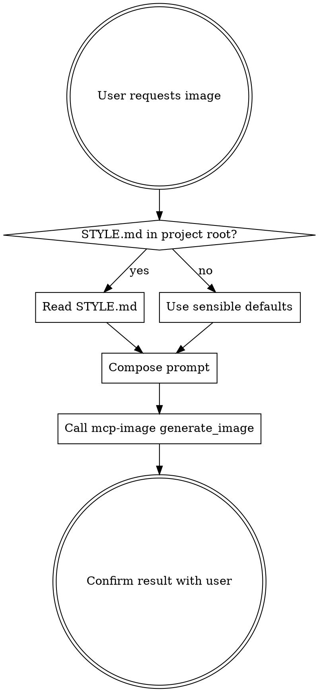

# Image Generation

## Overview

Generate images using the `mcp-image` MCP server (powered by Google Gemini). Always use this MCP — never use Python SDKs, browser automation, or AI Studio UI.

## Workflow

## Step 1: Check for Project Style Guide

Before composing any prompt, look for a `STYLE.md` file in the project root (same level as `CLAUDE.md`). This file defines the visual language for the project: color palette, art style references, mood, and constraints.

If no `STYLE.md` exists, use sensible defaults (painterly, no text unless requested, 16:9 for screens, 1:1 for icons).

## Step 2: Compose the Prompt

Build the prompt by combining:
1. **Subject** — what the image depicts (from the user's request)
2. **Style direction** — from `STYLE.md` or defaults
3. **Constraints** — aspect ratio, text rules, what to exclude
4. **Technical** — "Painterly oil painting with visible brushstrokes" or similar from style guide

Keep prompts detailed but under 300 words. Be specific about what should NOT appear (no text, no UI, no labels) — image models respond well to explicit exclusions.

## Step 3: Generate via MCP

Use the `mcp-image` tools:

| Tool | Use for |
|------|---------|
| `generate_image` | New images from text prompts |
| `edit_image` | Modify existing images |

Key parameters for `generate_image`:
- `prompt` — the composed prompt
- `aspectRatio` — match the use case (16:9 for screens, 1:1 for icons, etc.)
- `fileName` — descriptive kebab-case name (e.g., `title-screen`, `loading-unmaking`)
- `quality` — "fast" for drafts, "quality" for finals

Images auto-save to the configured output directory.

## Red Flags — STOP

- About to use Python/requests/SDK to call an image API → Use the MCP
- About to open Google AI Studio in a browser → Use the MCP
- About to generate without reading STYLE.md → Read it first
- Prompt has no exclusion constraints → Add "No text, no UI elements, no labels" or similar
- Using vague style language ("make it look cool") → Be specific: name art references, color palettes, techniques

## Common Mistakes

| Mistake | Fix |
|---------|-----|
| Generating without checking STYLE.md | Always check project root first |
| Oversaturated/busy images | Specify muted palettes and what to exclude |
| Unwanted text in generated images | Explicitly state "no text" or "ONLY text is X" |
| Wrong aspect ratio | Match use case: 16:9 screens, 1:1 icons, 3:4 portraits |
| Generic filenames | Use descriptive kebab-case: `loading-screen-unmaking.png` |
