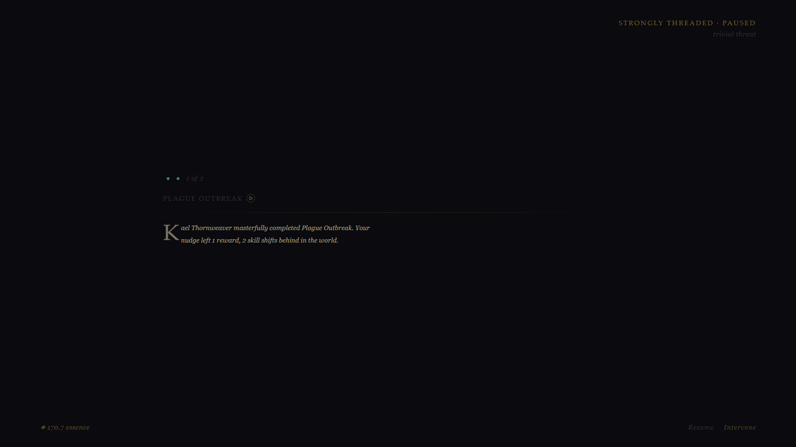
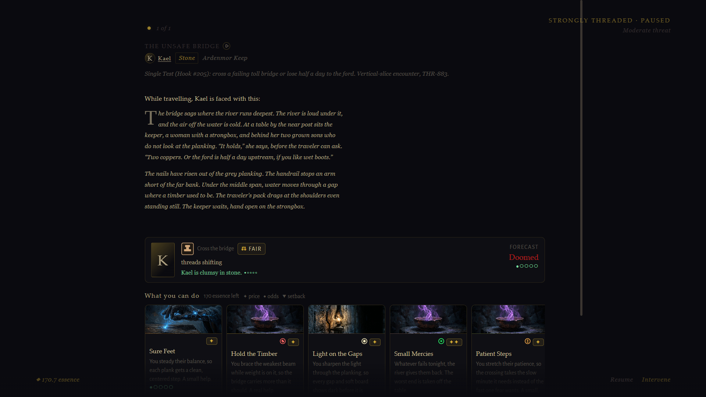
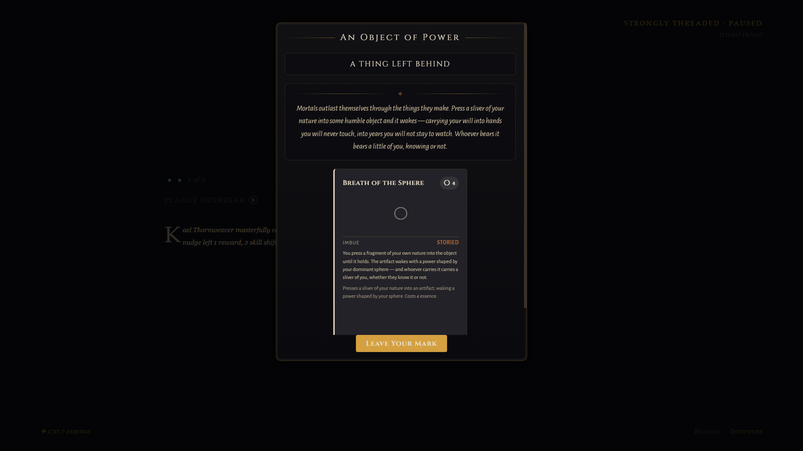
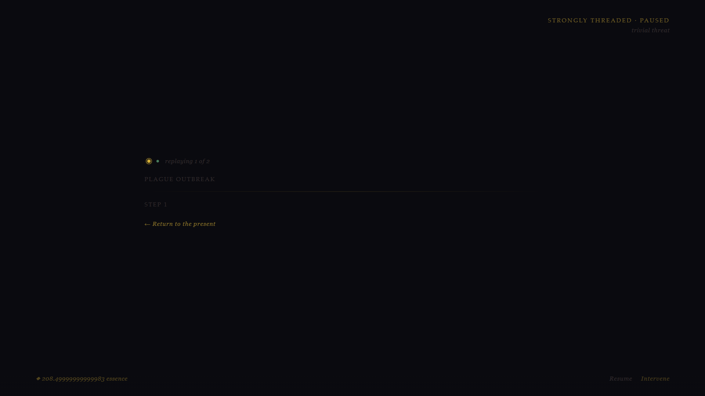

# THR-646 — browser verification of THR-636's encounter-context surfaces

**Date:** 2026-08-06 · **Ticket:** THR-646 (deferred verification artifact from THR-636, shipped in PR #549)
**Harness:** Playwright MCP, unattended run (`tb-opus-pickup`), viewport asserted 1920×1080 before every capture
**Route:** `http://localhost:5173/?view=game&seeded&size=medium&forceencounters`
**Build probe:** `typeof window.__DEBUG.getStepProse === "function"` — confirms the served build carries THR-636's code

## Verdict

THR-646 asked for three live screenshots. **Two were captured. The third is unreachable in the shipped build**, and finding out why is the substantive result of this pass.

| # | Surface | Result |
|---|---------|--------|
| a | Structured encounter toast card in the rail | **Cannot render** — `encounterCard` has zero writers → THR-993 |
| b | EncounterVeil context strip (portrait+name / location / reach chip) | **Captured**, and found empty on the common path → THR-994 |
| c | Replayed resolved step via the step navigator | **Captured**; replay body is blank on the fallback path → THR-994 |

No code changed in this pass. The ticket described itself as a "pure verification-artifact task — no code change expected", and that held: what it produced instead is two filed defects and the evidence behind them.

## (a) The encounter toast card cannot render

`EncounterNotificationCard` is rendered from exactly one place, `src/components/Game/ToastStack.tsx:124`, gated on `toast.encounterCard`. **Nothing in the repo ever assigns that field.** Exhaustive grep across `src/` and `scripts/`, tests included:

```
$ grep -rn "encounterCard\s*:" src/ scripts/
(no matches)

$ grep -rn "EncounterToastCard" src/ scripts/
src/components/Game/EncounterNotificationCard.tsx:14:  import type { EncounterToastCard } …
src/components/Game/EncounterNotificationCard.tsx:17:    card: EncounterToastCard;
src/types/notification.ts:102:export interface EncounterToastCard {
src/types/notification.ts:129:  encounterCard?: EncounterToastCard;
```

A type declaration, a reader, and a presentational component — no producer. Because the field is optional this type-checks cleanly, so no gate catches it: the optional-field-with-no-writer shape.

Confirmed at runtime by reading the live `ToastStack` fiber's `toasts` prop:

```
{ toastCount: 4, withEncounterCard: 0 }
```

All four live toasts took the plain-text `else` branch. The `aria-label` at `ToastStack.tsx:116` falls through identically, so the accessible name never carries the structured summary either.

**This is why THR-646 sat unfinished since 2026-07-05: it asks for a screenshot of a component that cannot appear.** Filed as **THR-993**.

## (b) The context strip — captured, and empty on the common path

`GameView.tsx:1308-1320` selects the veil model from three adapters. Only `buildUnifiedEncounterStageModel` populates the header's context fields; the fallback `buildSimpleEncounterStageModel` (`:241-247`) returns `title` / `locationLabel: ''` / `threatLabel` / `threadTier` and nothing else.

On a naturally-drawn encounter ("Plague Outbreak", Kael Thornweaver), reading the veil's React fiber props:

```
header: { title: "Plague Outbreak", locationLabel: "", threatLabel: "trivial" }
        // agentName, familyLabel, focalActorId, portraitUrl, reachLabel, hexCol, hexRow — ALL undefined
onShowOnMap:   "function"   ← handler wired, nothing to call it
onSelectAgent: "function"
```

`ContextStrip` (`EncounterVeil.tsx:1972-1976`) gates every element on exactly those fields, so it renders a zero-height flex container with no children — DOM confirms `childCount: 0`, `height: 0` at `y=497`.



The component itself is fine. A debug-spawned unified encounter renders it correctly:

```js
__DEBUG.spawnEncounter('Kael', 'encounter.slice.unsafe_bridge', { open: true })
// → { success: true, mode: "unified", actionId: "ua_33" }

header: { title: "The Unsafe Bridge", agentName: "Kael", familyLabel: "Kael",
          focalActorId: "npc_13", locationLabel: "Ardenmor Keep", reachLabel: "Stone",
          threatLabel: "Moderate" }
```



Portrait tile, clickable name **Kael**, reach chip **Stone**, location **Ardenmor Keep**. Note "Show on map" is still absent here — the debug spawn's notification carries no `hexCol`/`hexRow`, and `canShowOnMap` requires them.

Filed as **THR-994**.

## (c) Step replay — captured; navigator works, body is blank

The step navigator renders and is interactive. On the "Plague Outbreak" veil both dots carried `title="Step N — resolved"`:



Clicking Step 1 enters replay — the header switches to `replaying 1 of 2`, the selected dot takes a gold ring, and "← Return to the present" appears:



The body beneath "STEP 1" is **empty**, because the same fallback adapter emits history entries with no `replayNarrative` / `outcomeWord` / `afterimage`. The navigator works and has nothing to show. Same root cause as (b); covered by THR-994.

> **Capture note.** An unrelated `AscendantBeatModal` ("A Path Opens") sat over the veil at z-index 60 and could not be dismissed without making a game choice. It was hidden with `display:none` for this one capture and restored immediately afterwards. Nothing about the veil itself was altered.

## State assertion (Definition of Done requirement 3)

`window.__DEBUG.getStepProse('Kael')`, after a spawned 3-step encounter resolved:

```json
{ "actionId": "ua_34", "actorName": "Kael", "recordCount": 3,
  "records": [
    { "index": 0, "outcome": "success_at_cost", "reach": "iron",   "hasProse": true },
    { "index": 1, "outcome": "success_at_cost", "reach": "shadow", "hasProse": true },
    { "index": 2, "outcome": "near_miss",       "reach": "iron",   "hasProse": true }
  ] }
```

THR-636's per-step replay records are captured and readable. The engine side of the feature works; the gaps found are all in the presentation path.

## Viewport contract

Asserted in the same evaluate pass as each capture:

```
innerWidth: 1920, innerHeight: 1080
document.documentElement.scrollWidth <= innerWidth  → true
veil getBoundingClientRect() → { x: 0, y: 0, width: 1920, height: 1080 }
```

No horizontal overflow; the veil fills exactly one viewport.

## Console

Final state on a fresh load: **1 error, 69 warnings.**

```
[ERROR] Failed to load resource: net::ERR_CONNECTION_REFUSED @ http://localhost:3001/api/tts/health
```

Environmental — the optional TTS sidecar is not running in this sandbox; `ProseTtsButton` probes it on mount. Not an app error.

During extended ticking a second class appeared and was reproduced repeatedly:

```
[ERROR] Encountered two children with the same key, `amb_evt_17`. Keys should be unique…
```

That is **THR-853** ("Ambient event ids collide (amb_evt_17 ×9), producing duplicate React keys"), already in Ready for Dev — this run is live corroboration, not a new finding. Neither error class originates in THR-636's surfaces.

## Driving notes for whoever picks up THR-993 / THR-994

* `?forceencounters` surfaces threaded agents' encounters, but usually **after** their unified action has been reaped — which is precisely why it lands on the fallback adapter. To reach the unified path deterministically, use `__DEBUG.spawnEncounter(agent, templateId, { open: true })`; the result's `mode: "unified"` confirms which adapter will run.
* An open veil holds its encounter paused, so steps do not resolve while you watch. Spawn with `{ open: false }` and tick, or resume and let it re-surface.
* 147 of 682 templates carry 3+ steps (`encounter.deep_descent`, `encounter.trial_of_flame`, …), reachable in-page via `await import('/src/data/unified-action-templates.ts')`.
* The scripted opening beats (First Thread → A Place to Stand → Journey CALL) must be cleared before anything else renders; `[data-testid="beat-resolve-button"]` handles most of them.
