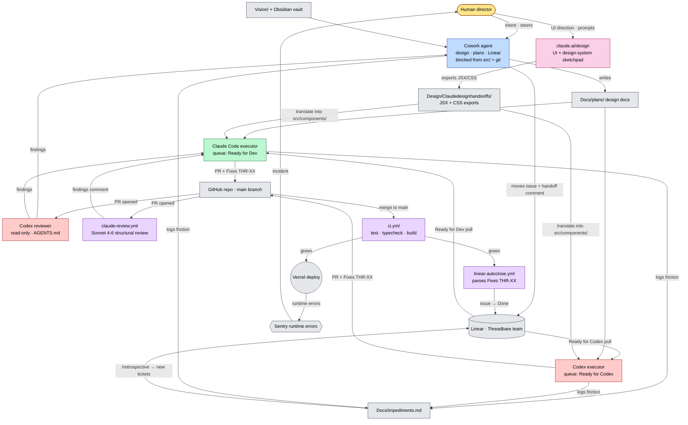

# Threadbearer — AI-Enabled SDLC & Tech Stack

A consolidated map of the tools, ways of working, and technologies that make up Threadbearer's AI-assisted software development lifecycle and runtime stack.

---

## 1. Narrative (≤150 words)

Threadbearer is a solo-built React/TypeScript game (Vite, Vitest, Three.js) where the human owns vision and judgment, and a small fleet of AI agents owns most of the keystrokes. **Cowork** designs and writes plans into `Docs/plans/`; **claude.ai/design** is used as a UI sketchpad for design-system and component work, producing JSX handoffs that land in `Design/Claudedesignhandooffs/` before integration; **Claude Code** and **Codex** are two parallel executor queues that pull tickets out of **Linear**; a Claude-powered **structural reviewer** runs on every PR. Each role is enforced by hardcoded boundaries — bash hooks block Cowork from touching `src/` or running git, and `AGENTS.md` blocks Codex from writing code. Handoffs happen via Linear state plus a coordination block. Merging to main with `Fixes THR-XX` auto-closes the issue. The "feel" is less *pair programming* and more *running a small studio* where a director keeps specialists in their lanes.

---

## 2. SDLC Table

| Stage | Tool(s) | How it's used | Human / AI split | Typical output |
|---|---|---|---|---|
| **Research** | Obsidian vault (LLM knowledge base, with `vault-ingest`/`vault-query` skills); web defuddle skill; raw `Vision/` folder | Co-pilot — agents compile raw sources into wiki pages humans direct | 40 / 60 | Wiki page in `TheFantasyWorldSimulator/`, entry in `log.md` |
| **Ideate** | Cowork + `cw-brainstorming` and `product-brainstorming` skills; `Brainstorms/` folder paired 1:1 with plan docs | Agent as sparring partner; human picks the thread to pursue | 60 / 40 | Brainstorm note + Linear issue in `Idea` state |
| **Design** | Cowork + `game-design-direction` skill; design docs in `Docs/plans/`; three-pillar rule (Engine / Content / UI); `design-system` and `design-critique` skills; **claude.ai/design for UI / design-system work — exports staged in `Design/Claudedesignhandooffs/`** | Agent drafts plan + UI sketch; human picks the visual direction; Cowork audits against 7 NFPs | 30 / 70 | Plan doc + NFP table + Vision audit + JSX/CSS handoff folder |
| **Architect** | Codesight (`.codesight/`, MCP server, SessionStart regen); ADRs via `engineering:architecture` skill; `CLAUDE.md` Load-Bearing Decisions | Codesight as map; agent drafts ADRs; human ratifies load-bearing calls | 30 / 70 | ADR or "Load-Bearing Decision" added to `CLAUDE.md` |
| **Build** | Two parallel executors: **Claude Code** (`Ready for Dev`, judgment-heavy) and **Codex executor** (`Ready for Codex`, mechanical); `model:haiku/sonnet/opus` labels route to the right model; executors translate claude.ai/design handoffs in `Design/Claudedesignhandooffs/` into integrated components under `src/components/`; bash pre-commit hooks (`.claude/hooks/pre-commit-gate.sh`) enforce typecheck + tests | Agent as implementer, human as merge gate | 10 / 90 | Commit with `Fixes THR-XX`, PR pushed to GitHub |
| **Review** | Two surfaces: (a) **Codex-the-reviewer** — read-only, follows `AGENTS.md` checklist (NFP tiers, wiring, rejected approaches); (b) **`claude-review.yml`** — Claude Sonnet 4-6 structural review on every PR via heartbeat-wrapped subprocess, advisory until branch protection lands | Reviewer (agents) + human merge gate | 5 / 95 | Findings JSON, PR comment with verdict (none/minor/major), commit trailer |
| **Test** | `npm test` (Vitest), `npx tsc --noEmit`, `npx vite build`; CLI smoke harness (`npm run cli`) for headless game ticks; `npm run balance:smoke/cadence/journey` for game-balance evals; `testing-patterns` skill | Agents run before commit; CI re-runs in `ci.yml`; humans rarely run manually | 5 / 95 | Test run, balance eval JSON in `.cache/` |
| **Deploy** | Push to `main` → GitHub Actions `ci.yml` (test/typecheck/build) → Vercel auto-deploys → `linear-autoclose.yml` parses `Fixes THR-XX` and closes Linear issue via GraphQL | Orchestrator (no humans in loop) | 0 / 100 | Live build at Vercel URL, Linear issue → `Done` |
| **Operate** | Sentry (`@sentry/react`) for runtime errors; `Docs/impediments.md` (every agent logs friction via `impediment-reporter` skill); `/retrospective` skill periodically converts impediments → Linear issues; in-game debug bridge (`window.__DEBUG`) | Agents observe and log; humans read retros and re-prioritize | 50 / 50 | Impediment log entry, retrospective doc, new Linear issue feeding back into Ideate |

---

## 3. SDLC Handoff — Mermaid Diagram

> Interactive version with SVG/PNG export: [`sdlc-handoff-flow.html`](./sdlc-handoff-flow.html)

---

## 4. Distinctive Ways of Working

**Two-queue, single-human handoff.** Work is routed to the right executor *before* it lands in their inbox — Cowork picks `Ready for Dev` (Claude Code) vs `Ready for Codex` based on whether the work needs judgment or pattern-following, and tags a model size. The director never assigns work mid-flight; the queue does.

**Hardcoded role boundaries enforced by hooks, not trust.** Each agent's lane is enforced by bash pre-tool hooks in `.claude/hooks/` (Cowork blocked from writing `src/` or running `git`), by `AGENTS.md` (Codex reviewer is read-only), and by GitHub permissions (`claude-review.yml` aborts if its token has push scope). Misuse is mechanically prevented, not policed.

**Merge-gated "done" with auto-close.** No agent can mark an issue complete — `Done` only happens when a commit containing `Fixes THR-XX` is merged to `main`, which triggers the `linear-autoclose.yml` workflow to flip the Linear state. This makes "shipped" and "closed" the same event, eliminating the gap where work claims to be done but isn't deployed.

**Design surface separated from integration surface.** UI work is sketched in claude.ai/design and lands in a quarantined `Design/Claudedesignhandooffs/` folder; an executor agent then *translates* it into the integrated component tree under `src/components/`. The design tool never touches production code directly — exploration and integration are kept on different sides of a clear handoff boundary.

---

## 5. Technology Stack — Layered View

> Visual version: [`threadbearer-tech-stack.html`](./threadbearer-tech-stack.html)

The end-to-end software stack that supports the game, layered by responsibility.

### Browser Runtime
What the player (or agent QA) actually sees and clicks.

- **UI shell** — React 19 · TypeScript · Tailwind 4 · 244 components incl. Game, Codex, Remembrance, MeetTheFirst, StyleGuide
- **WebGL hex map** — Three.js (raw, no R3F) · 30+ `InstancedMesh` layers · custom fog shader · d3-zoom camera
- **Audio** — `AudioMaster` with Music / UI / Background channels · TTS via `kokoro-js`
- **Error capture** — Sentry React SDK (dev-only DSN — no production telemetry)

### Game Engine
The simulation itself — pure functions over a graph.

- **Graph core** — Everything is a node/edge · `WorldGraph` in-place mutation with `worldVersion` / `structuralCacheVersion` touch API
- **Tick loop** — ~292 engine modules · phased orchestrator · seeded PRNG everywhere · fail-soft (never throws)
- **Agent & encounter systems** — Ambitions, agendas, factions, attachments, conditions, divine intervention, hex actor index
- **Prose pipeline** — Graph-walking resolvers · enrichment placeholders (`{name}`, `{ally}`) · vignettes & backstory strata

### Content & CMS
The data the engine reads from. Authored, not generated at runtime.

- **`world-model.json`** — Single canonical world definition · validated by `npm run validate-model`
- **Content tables** — 200+ files in `src/data/` — encounters, attachments, agendas, archetypes, factions, prose
- **CMS browser** — `?view=cms` · in-app content browser, detail panel, viewers, registry
- **Composition DSL** — `src/composition-dsl/` · schema + validator + mutation gate for composable content

### Authoring Tools
How content, art, and knowledge get produced.

- **Obsidian vault** — LLM knowledge base · `generate-vault` + `rebuild-index` · ingest / query / lint / enrich skills
- **Hex tile generator** — Python pipeline (`generate-hex-tile.py`) · batch & audit modes · `sharp`-based resize
- **3D asset MCPs** — Blender MCP for modelling · Meshy AI MCP for generated meshes
- **Design handoff** — claude.ai/design exports staged in `Design/Claudedesignhandooffs/`

### Debug & Observability
How problems get found, traced, and reproduced.

- **Trace buffer** — Per-tick `traceBuffer` · typed trace categories · imported by 106 files for inspectability
- **Debug bridge** — `window.__DEBUG` dev API — open panel, fire actions, goto agent, export encounter logs · tree-shaken in prod
- **In-game CLI & F1 panel** — Multi-line command panel inside the game · same commands as the headless REPL
- **Headless CLI & balance evals** — `npm run cli` REPL · `balance:smoke` / `cadence` / `journey` for tuning

### Build, Test & Quality
Local toolchain and quality gates.

- **Build** — Vite 7 · TypeScript 5.9 · Tailwind 4 (Vite plugin) · esbuild for Node scripts
- **Test** — Vitest 4 · jsdom · Testing Library · contract / regression suites
- **Lint & static analysis** — ESLint 9 · typescript-eslint · Codesight (MCP + `.codesight/` wiki regenerated each session)
- **Pre-commit gates** — Husky · skill-sync check · custom `.claude/hooks/` typecheck + test gate before `git commit`

### Coordination & CI/CD
How work, agents, and deploys are orchestrated.

- **Linear (Threadbare team)** — Single source of truth · `Ready for Dev` + `Ready for Codex` queues · `model:*` labels
- **GitHub Actions** — `ci.yml` (test/typecheck/build) · `claude-review.yml` (Sonnet 4-6 PR review) · `linear-autoclose.yml`
- **Vercel** — Auto-deploys on push to `main`
- **MCP servers & agent skills** — Codesight, Chrome DevTools, Meshy, Blender, Obsidian · 30+ project skills in `.claude/skills/`

---

## 6. Companion Files

| File | Purpose |
|---|---|
| [`threadbearer-tech-stack.html`](./threadbearer-tech-stack.html) | Polished visual layered stack diagram (open in browser, screenshot for slide) |
| [`sdlc-handoff-flow.html`](./sdlc-handoff-flow.html) | Interactive Mermaid SDLC flow with one-click SVG / PNG export |
| [`threadbearer-stack.md`](./threadbearer-stack.md) | This consolidated document |
