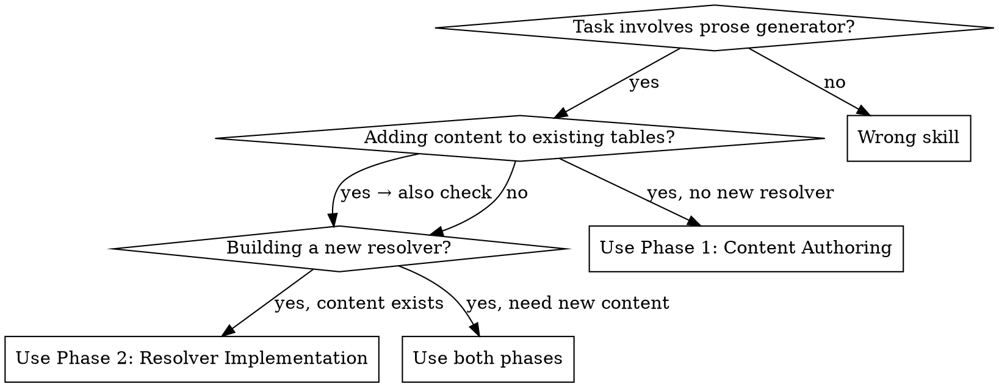

# Prose Resolver — Content Authoring & System Extension

## Overview

This skill guides two coupled workflows for The Fantasy World Simulator's graph-walking prose generator:

1. **Content Authoring** — Writing new prose fragments for existing content tables in `prose-layer-content.ts`
2. **Resolver Implementation** — Building new resolvers that walk graph edges and produce `ProseLayer` fragments

Both workflows draw creative inspiration from the **Inspirational Catalogue — Worldbuilding Reference Wiki** in Notion and must follow the **Threadbare** aesthetic: dark world, hidden magic, beauty first with darkness emerging from details.

## When to Use



## Context Gathering (Do This First, Always)

Before writing any prose, gather three things:

### 1. Read the Tonal Bible
Fetch the Tonal Bible from Notion (page ID: `31e2b241-dfb0-8135-a77c-c6a3ee05598e`). Internalize the Five Blend Principles:

| Principle | What it means for prose |
|-----------|------------------------|
| Ascendancy as Burden | Power costs something human. Divine gestures feel weighty, exhausting. |
| Cultural Mosaic with Contradictions | First impressions are vivid archetypes. Deeper layers reveal cracks. |
| Convergence as Set-Piece | Pressure builds with inevitability. Aftermath is messy, not clean. |
| Deep Time in Fragments | History is glimpsed, not lectured. Ruins and offhand remarks, not textbooks. |
| Wonder Layered Over Grief | Lead with beauty. Let darkness emerge from details, not grim adjectives. |

### 2. Fetch the Relevant Wiki Archetype Page
The Inspirational Catalogue lives under Notion page `31e2b241-dfb0-812d-bb9a-f8f5e8aa06eb`. Navigate to the specific archetype page matching your content type:

| Content type | Wiki page to fetch |
|--------------|-------------------|
| Character/Agent prose | Character Archetypes (`31e2b241-dfb0-8124-aa86-d7afd09df740`) |
| Location/Place prose | Place Archetypes (`31e2b241-dfb0-811a-86e9-d52f58acca48`) |
| Culture prose | Culture Archetypes (search from landing page) |
| Artifact/Object prose | Artifact Archetypes (search from landing page) |
| Faction/Army prose | Faction Archetypes / Army Archetypes (search from landing page) |
| Divine/God prose | God & Divine Being Archetypes (search from landing page) |
| Monster prose | Monster Archetypes (search from landing page) |
| Event/Encounter prose | Event Archetypes / Adventure & Quest Archetypes (search from landing page) |
| Spell/Magic prose | Spell & Magic System Archetypes (search from landing page) |

Each wiki entry contains: Core Tension, Source Inspiration, Defining Traits, Tonal Notes, and Game System Hooks. Use these as creative fuel — not as templates to copy.

### 3. Read the Existing Content
Read `src/data/prose-layer-content.ts` to understand existing tone, length, and pattern. Read the specific content table you're extending or the resolver you're paralleling.

---

## Phase 1: Content Authoring

Use this when adding new entries to existing `Record<string, string[]>` tables in `prose-layer-content.ts`.

### The Prose Fragment Pattern

Every entry in a content table is a **prose fragment** — a self-contained descriptive passage that will be composed with other fragments into a full entity description. Fragments must work alone (for summary mode) and alongside other fragments (for full mode).

**Shape:** 1-3 sentences. Never more. The composer joins multiple fragments with paragraph breaks, so each fragment IS a paragraph.

**Placeholders:** Use `{name}`, `{faction}`, `{agent}`, `{archetype}`, `{terrain}`, `{sphere}`, `{culture}` as needed. These are resolved at generation time by `replacePlaceholder()`.

### Content Authoring Checklist

- [ ] **Read Tonal Bible** from Notion
- [ ] **Read relevant wiki archetype page** for the content type
- [ ] **Read existing entries** in the target content table
- [ ] **Identify the gap** — which keys have too few entries? Which keys are missing entirely?
- [ ] **Write 2-4 draft fragments** per key, following the tone rules below
- [ ] **Self-edit pass** — apply the Threadbare Tone Rules
- [ ] **Verify placeholder usage** — match the pattern of existing entries
- [ ] **Run tests** — `npm test -- prose-layer-content` to verify structure

### Threadbare Tone Rules

These rules encode the Tonal Bible into actionable prose craft. Apply them to every fragment.

**DO:**
- Lead with sensory detail, not abstraction. Ground the reader in a specific image.
- Use concrete nouns over vague ones. "Stone" not "structure". "Moss" not "nature".
- Let darkness emerge from observed detail, not from adjectives. "The toy in the ash" not "the terrible destruction".
- Write in present tense, as observation. The prose is a camera, not a narrator.
- Allow contradiction within a single fragment. A place can be both beautiful and hostile.
- Use em-dashes for asides that add tension or irony.
- Vary sentence length. Short declarative sentences hit harder after longer descriptive ones.
- Reference time, decay, and the weight of history. The Threadbare world is old.

**DON'T:**
- Use superlatives or absolutes ("the greatest", "utterly", "completely").
- Use generic fantasy adjectives ("eldritch", "arcane", "mystical", "ethereal").
- Moralize or editorialize. The prose observes; it doesn't judge.
- Use exclamation marks. Ever.
- Write purple prose — ornate language that draws attention to itself rather than the subject.
- Use cliche fantasy constructions ("a chill ran down their spine", "ancient evil", "dark lord").
- Explain what things mean. Let the image carry the meaning.
- Use more than one metaphor per fragment. One strong image beats three mixed ones.

### Tone Calibration Examples

**For biome/terrain prose (atmosphere category):**
> Bad: "The mystical forest was filled with ancient, eldritch power that made all who entered tremble."
> Good: "The forest closes in with the weight of a tomb, ancient trees pressed shoulder to shoulder. Sunlight struggles to reach the floor where ferns uncoil in perpetual twilight."

**For culture prose (character category):**
> Bad: "The great civilization built magnificent temples to honor their powerful gods."
> Good: "Every structure speaks of intention and forward planning. Laws are written in the arrangement of buildings. The Light brings safety but also exposure — nothing is hidden."

**For agent/archetype prose (origin category):**
> Bad: "The brave warrior had seen many battles and was haunted by the ghosts of his past."
> Good: "{name} exists in a state of coiled violence — muscles tight with the knowledge of their own capacity to cause harm, burdened by the history of times they've used it."

**For faction prose (character category):**
> Bad: "The evil faction controlled the city with an iron fist, spreading fear wherever they went."
> Good: "{faction} holds the location through force carefully applied in just sufficient amounts — the threat of greater violence keeping actual violence minimal."

### Wiki-to-Prose Translation

When drawing from the Notion wiki, translate archetype entries into prose fragments using this process:

1. **Read the Core Tension** — this becomes the emotional center of the fragment
2. **Note the Tonal Notes** — these set the aesthetic register (lyrical? blunt? ironic?)
3. **Extract one image** from the Source Inspiration — one concrete detail that captures the archetype
4. **Write the fragment** around that image, inflected by the core tension
5. **Strip any direct reference** to the source material — the fragment must stand alone

Example translation from Character Archetype wiki entry:
- Wiki: "Reluctant Veteran — Core Tension: duty vs. exhaustion. Tonal Note: speaks in short sentences, long silences."
- Fragment: `"{name} speaks in short sentences and long silences, as if words might trigger something they've worked hard to keep restrained."`

### Content Table Reference

Current tables in `prose-layer-content.ts` and their key types:

| Table | Key type | Placeholder(s) | Category |
|-------|----------|----------------|----------|
| `BIOME_PROSE` | TerrainType (23 types) | none | atmosphere |
| `CULTURE_LOCATION_PROSE` | foundationPair (4 combos) | none | character |
| `SPHERE_LOCATION_PROSE` | SphereName (8 spheres) | none | atmosphere |
| `SUBTYPE_ESTABLISHING_PROSE` | LocationSubtype (20 types) | `{name}` | origin |
| `FACTION_CONTROL_PROSE` | (flat array) | `{faction}` | character |
| `POPULATION_PROSE_TEMPLATES` | (flat array) | `{agent}`, `{archetype}` | character |
| `ARCHETYPE_PROSE` | archetype name (19 types) | `{name}` | origin |
| `DISPOSITION_PROSE` | strategy name (5 types) | `{name}` | character |

**Target density:** Each keyed entry should have 2-4 fragments for good PRNG variety. Check counts and fill gaps.

---

## Phase 2: Resolver Implementation

Use this when building a new resolver function that walks graph edges and produces `ProseLayer[]`.

### Resolver Architecture Refresher

```
generateEntityProse(nodeId, graph, seed, mode)
  → look up node type
  → get registered resolvers for type
  → run each resolver → collect ProseLayer[]
  → sort by priority, cap per category (max 2)
  → compose into string (summary or full mode)
```

Each resolver is a pure function: `(nodeId: string, graph: WorldGraph, seed: number) => ProseLayer[]`

### Resolver Implementation Checklist

- [ ] **Read the design doc** — `Docs/plans/2026-03-09-prose-generator-framework-design.md` for the resolver spec
- [ ] **Read existing resolvers** — `src/engine/proseResolvers.ts` for the established pattern
- [ ] **Read Tonal Bible + relevant wiki page** for content inspiration
- [ ] **Identify the graph path** — what edge type or property does this resolver walk?
- [ ] **Write tests first** (TDD) — test the resolver returns correct layers for known graph shapes
- [ ] **Create the content table** in `prose-layer-content.ts` (Phase 1 workflow)
- [ ] **Implement the resolver** in `proseResolvers.ts` following the standard pattern
- [ ] **Register the resolver** in `proseGenerator.ts` RESOLVER_REGISTRY
- [ ] **Export from proseResolvers.ts** and import in proseGenerator.ts
- [ ] **Run full test suite** — `npm test`
- [ ] **Verify trace emission** — check debug panel (backtick key) shows the new resolver's contributions

### The Standard Resolver Pattern

Every resolver follows this exact structure. Do not deviate.

```typescript
/**
 * {name}Resolver — {description}.
 * Priority: {N} ({category})
 * Category: '{category}'
 *
 * {Graph path description: Node -> edge_type -> Target node}
 * Reads {property} from {source}.
 */
export function {name}Resolver(
  nodeId: string,
  graph: WorldGraph,
  seed: number,
): ProseLayer[] {
  // 1. Get the node — fail soft
  const node = graph.getNode(nodeId);
  if (!node) return [];

  // 2. Get the property or walk the edge — fail soft
  const prop = node.properties?.{property} as {Type} | undefined;
  if (!prop) return [];
  // OR for edge-walking:
  // const edges = graph.getOutgoingEdges(nodeId, '{edgeType}');
  // if (edges.length === 0) return [];
  // const targetNode = graph.getNode(edges[0].target);
  // if (!targetNode) return [];

  // 3. Look up content templates — fail soft
  const templates = {CONTENT_TABLE}[{key}];
  if (!templates) return [];

  // 4. Pick template via seeded PRNG — fail soft
  const template = pickTemplate(templates, seed);
  if (!template) return [];

  // 5. Replace placeholders
  const text = replacePlaceholder(template, '{placeholder}', {value});

  // 6. Return ProseLayer with correct priority and category
  return [{
    text,
    priority: {N},
    category: '{category}',
    source: '{name}Resolver',
  }];
}
```

**Critical rules:**
- Every step has a fail-soft return `[]`. Never throw.
- Use `pickTemplate(templates, seed)` for PRNG selection — never `Math.random()`.
- Use `replacePlaceholder(text, key, value)` — never string concatenation or template literals for placeholder resolution.
- The `source` field must match the function name for debug tracing.

### Unimplemented Resolvers from Design Doc

These resolvers are specified in the design doc but not yet implemented:

**Location:**
| Resolver | Edge/Property | Priority | Category | Status |
|----------|--------------|----------|----------|--------|
| `historyResolver` | events/encounters | 40 | history | Not implemented |

**Agent:**
| Resolver | Edge/Property | Priority | Category | Status |
|----------|--------------|----------|----------|--------|
| `locationResolver` | outgoing `located_at` | 80 | atmosphere | Not implemented |
| `traitResolver` | outgoing `has_trait` | 50 | history | Not implemented |

**Artifact (entire category):**
| Resolver | Edge/Property | Priority | Category | Status |
|----------|--------------|----------|----------|--------|
| `loreResolver` | `properties.sphereAffinity` | 100 | origin | Not implemented |
| `possessorResolver` | incoming `possesses`/`bonded_to` | 80 | character | Not implemented |
| `locationResolver` | `properties.locationId` | 60 | atmosphere | Not implemented |

When implementing these, follow the priority and category assignments from the design doc exactly.

### Registering a New Resolver

After implementing the resolver function:

1. **Export** from `proseResolvers.ts`
2. **Import** in `proseGenerator.ts`
3. **Add** to the appropriate array:

```typescript
// In proseGenerator.ts
const LOCATION_RESOLVERS: ProseResolver[] = [
  subtypeResolver,
  biomeResolver,
  cultureResolver,
  sphereResolver,
  factionResolver,
  populationResolver,
  historyResolver,        // ← new resolver added at correct position
];
```

4. For new entity types (e.g., artifact), add a new entry to `RESOLVER_REGISTRY`:

```typescript
const ARTIFACT_RESOLVERS: ProseResolver[] = [
  loreResolver,
  possessorResolver,
  artifactLocationResolver,
];

const RESOLVER_REGISTRY: Record<string, ProseResolver[]> = {
  location: LOCATION_RESOLVERS,
  actor: ACTOR_RESOLVERS,
  artifact: ARTIFACT_RESOLVERS,  // ← new entity type
};
```

### Priority and Category Assignment

Priorities determine composition order (higher = appears first). Categories cap diversity (max 2 per category).

| Priority range | Meaning | Examples |
|---------------|---------|---------|
| 100 | Core identity — what IS this entity | subtypeResolver, archetypeResolver, loreResolver |
| 80-90 | Primary character — what shapes it | biomeResolver, cultureResolver, agentCultureResolver |
| 60-70 | Secondary character — who controls/influences it | sphereResolver, factionResolver, dispositionResolver |
| 40-50 | Background — history and context | historyResolver, traitResolver, populationResolver |

| Category | What it covers | Max per composed output |
|----------|---------------|----------------------|
| `origin` | What the entity fundamentally is | 2 |
| `atmosphere` | How the entity feels, its environment | 2 |
| `character` | Who shaped it, who controls it, social identity | 2 |
| `tension` | Conflicts, contradictions, pressure points | 2 |
| `history` | What happened here, past events | 2 |

---

## Common Mistakes

| Mistake | Fix |
|---------|-----|
| Writing fragments longer than 3 sentences | Split into multiple fragments or trim. Each fragment is one paragraph. |
| Using `Math.random()` instead of seeded PRNG | Always use `pickTemplate(templates, seed)` or `mulberry32(seed)` |
| Forgetting fail-soft returns | Every graph lookup, property access, and template lookup must have `if (!x) return []` |
| Writing prose that explains instead of observes | Cut any sentence that starts with "This means..." or "This represents..." |
| Copying wiki text verbatim | Translate the core tension into original prose. The wiki is inspiration, not source material. |
| Using generic fantasy language | Replace "ancient evil" with specific observed detail. Replace "mystical" with a concrete image. |
| Not checking existing entry count | Each key should have 2-4 fragments. Don't add a 5th when another key has 0. |
| Skipping the Tonal Bible read | The Five Blend Principles are load-bearing. Read them every time. |

## Quick Reference: File Locations

| File | Purpose |
|------|---------|
| `src/data/prose-layer-content.ts` | All prose fragment content tables |
| `src/engine/proseResolvers.ts` | All resolver implementations |
| `src/engine/proseGenerator.ts` | Public API + resolver registry |
| `src/engine/proseComposer.ts` | Composition logic (sort, cap, join) |
| `src/types/prose.ts` | Type definitions + tunable constants |
| `Docs/plans/2026-03-09-prose-generator-framework-design.md` | Full architecture design doc |
| Notion: Tonal Bible | `31e2b241-dfb0-8135-a77c-c6a3ee05598e` |
| Notion: Wiki landing | `31e2b241-dfb0-812d-bb9a-f8f5e8aa06eb` |
| Notion: Character Archetypes | `31e2b241-dfb0-8124-aa86-d7afd09df740` |
| Notion: Place Archetypes | `31e2b241-dfb0-811a-86e9-d52f58acca48` |
